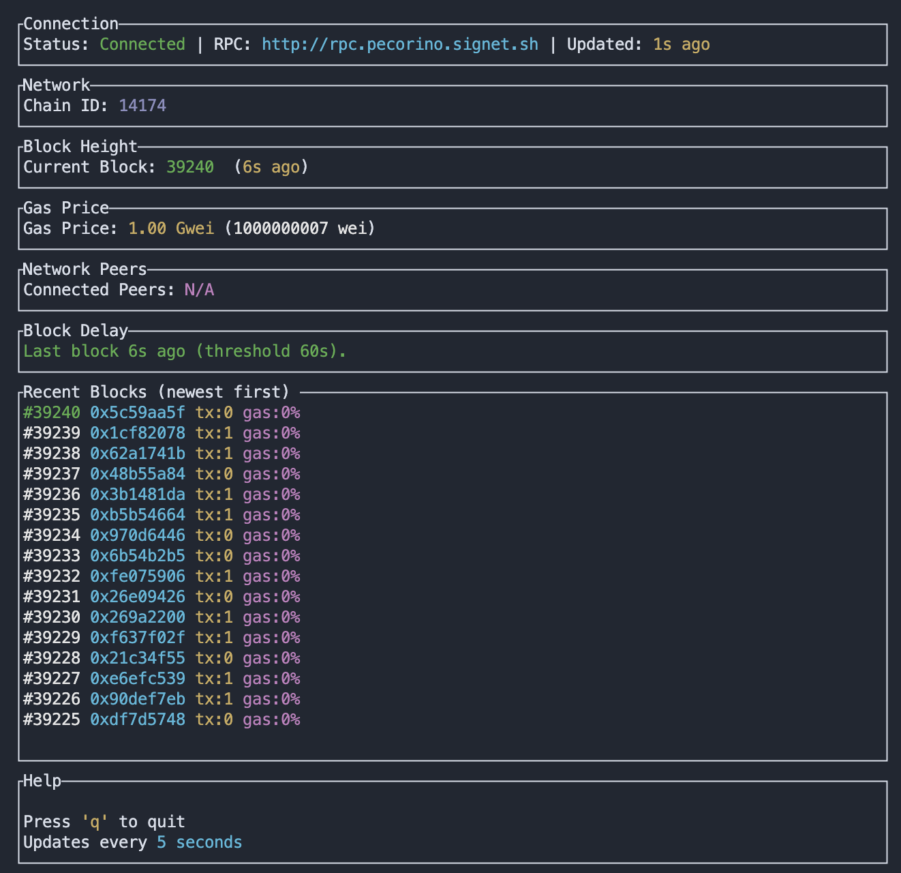

# FutureSight 🔮

> "Is the inevitable any less miraculous?" - _Veldka, wandering sage_

FutureSight is a minimal terminal dashboard for interacting with and observing the [Signet](https://signet.sh) network.

 

## Dashboard



FutureSight currently displays the following data:

- **Connection Status**: Current RPC connection state and last update time
- **Chain Halt Detection**: Alerts if a new block hasn't been detected within the configured threshold
- **Recent Blocks**: Rolling history of the latest blocks with tx count & gas utilization
- **Block Height**: Displays the latest block number from the network
- **Gas Price**: Current gas price displayed in gwei and wei
- **Alerts**: Stale connection and block delay warnings
 - **Tx Pool (optional)**: If a tx-pool-webservice is configured, shows health and cache sizes for Transactions, Bundles, and Signed Orders

## Installation

*Pre-requisites: `make` and `rust` tooling*

Clone the repository and build with Cargo:

```bash
git clone https://github.com/dylanlott/futuresight
cd futuresight
cargo build --release && cargo run
```

## Usage

`tl;dr` `make run`  starts the dashboard for the Pecorino test net.

```bash
# equivalent to make run
cargo run -- http://rpc.pecorino.signet.sh 30 

# with tx-pool-webservice metrics (fetches JSON from /transactions, /bundles, /signed-orders)
TXPOOL_URL=http://localhost:8080 cargo run
# or
cargo run -- --txpool-url http://localhost:8080
```

### Make Commands

Common shortcuts:

```bash
make build        # debug build
make release      # optimized build
make run          # run FutureSight (targets Pecorino test network by default)
make fmt          # run cargo fmt
make lint         # run clippy
make test         # run tests
```

### Controls

- **q** or **Esc**: Quit the application

### Configuration

You can configure FutureSight via CLI flags or environment variables.

- RPC URL
	- Positional arg: `cargo run -- <RPC_URL>`
	- Env: `RPC_URL=http://...`
	- Default: `http://rpc.pecorino.signet.sh`
- Block delay alert threshold (seconds)
	- Positional arg: `cargo run -- <RPC_URL> <BLOCK_DELAY_SECS>`
	- Flag/env: `--block-delay-secs <N>` or `BLOCK_DELAY_SECS=<N>`
	- Default: `60`
- Refresh interval (seconds)
	- Flag/env: `-r, --refresh-interval <N>` or `REFRESH_INTERVAL=<N>`
	- Default: `5`
- Max block history (entries kept/displayed)
	- Flag/env: `--max-block-history <N>` or `MAX_BLOCK_HISTORY=<N>`
	- Default: `20`
- Tx-pool-webservice integration
	- Flag/env: `--txpool-url <URL>` or `TXPOOL_URL=<URL>`
	- FutureSight requests JSON from `<URL>/transactions`, `<URL>/bundles`, and `<URL>/signed-orders` and computes counts from the returned items.
	- The dashboard shows: health, last update, and item counts for Transactions, Bundles, and Signed Orders.

Notes:
- The endpoints should return arrays or an object containing an array property (e.g., `items`, `data`, `transactions`, `bundles`, `signedOrders`, `signed_orders`). FutureSight counts the items accordingly.

## License

This project is open source and available under the MIT License.