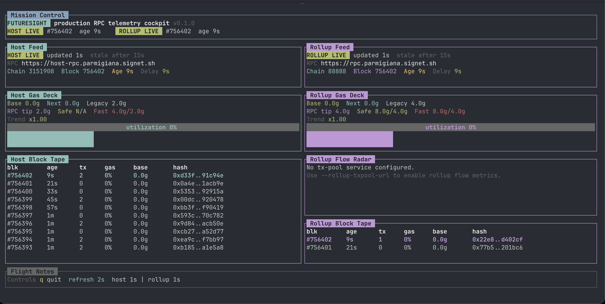

# FutureSight

FutureSight is a Rust terminal dashboard for monitoring Ethereum RPC health, recent block flow, fee pressure, and optional tx-pool activity across a host chain and a rollup.




## What It Shows

- Connection state with stale and error signaling
- Current chain ID and latest observed block
- Block age and chain halt alerts
- EIP-1559 fee telemetry, fee suggestions, utilization gauge, and fee trend sparkline
- Rolling block tape with gas usage and base fee context
- Optional tx-pool service health, cache counts, and recent transactions

## Build

Prerequisites: Rust toolchain and `make`.

```bash
git clone https://github.com/dylanlott/futuresight
cd futuresight
cargo build --release
```

## Run

The default endpoints target the Parmigiana Signet environment.

```bash
cargo run
```

Enable tx-pool telemetry explicitly:

```bash
cargo run -- \
  --txpool-url http://localhost:8080 \
  --rollup-txpool-url https://transactions.parmigiana.signet.sh
```

Tune refresh rate and history depth:

```bash
cargo run -- \
  --refresh-interval 3 \
  --max-block-history 40 \
  --block-delay-secs 90
```

Filter host tx-pool rows to specific contracts:

```bash
cargo run -- \
  --txpool-url http://localhost:8080 \
  --host-contracts 0x1234...,0xabcd...
```

## Configuration

Every major flag can also be set through environment variables.

| Flag | Env | Default |
| --- | --- | --- |
| `--host-rpc-url` | `HOST_RPC_URL` | `https://host-rpc.parmigiana.signet.sh` |
| `--rollup-rpc-url` | `ROLLUP_RPC_URL` | `https://rpc.parmigiana.signet.sh` |
| `--block-delay-secs` | `BLOCK_DELAY_SECS` | `60` |
| `--refresh-interval` | `REFRESH_INTERVAL` | `2` |
| `--max-block-history` | `MAX_BLOCK_HISTORY` | `24` |
| `--txpool-max-rows` | `TXPOOL_MAX_ROWS` | `12` |
| `--txpool-url` | `TXPOOL_URL` | unset |
| `--rollup-txpool-url` | `ROLLUP_TXPOOL_URL` | unset |
| `--host-contracts` | `HOST_CONTRACTS` | unset |

## Controls

- `q`
- `Esc`

## Make Targets

```bash
make parmigiana
make build
make release
make run
make fmt
make lint
make test
```
